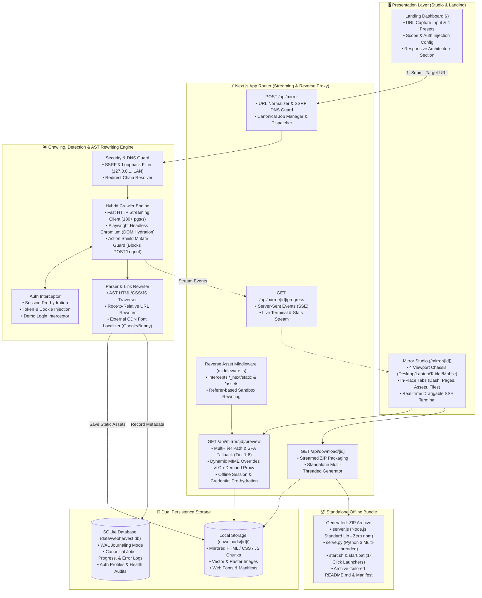

<div align="center">


# WebHarvest 🌐

### **Intelligent Website Cloner & Interactive Offline Mirror Studio**

*Mirror, inspect, live-stream, and download complete static & Single-Page Applications with zero-dependency standalone offline bundles.*

[](https://nextjs.org/)
[](https://react.dev/)
[](https://www.typescriptlang.org/)
[](https://tailwindcss.com/)
[](https://www.sqlite.org/)
[](LICENSE)

</div>

---

## 📑 Table of Contents

- [Overview & Purpose](#-overview--purpose)
- [Key Features](#-key-features)
- [System Architecture](#-system-architecture)
- [The Scrape Lifecycle (What Happens During a Scrape)](#-the-scrape-lifecycle-what-happens-during-a-scrape)
- [Directory Structure](#-directory-structure)
- [How It Works](#-how-it-works)
- [Getting Started](#-getting-started)
- [API Reference](#-api-reference)
- [Standalone Offline Bundles](#-standalone-offline-bundles)
- [Tech Stack](#-tech-stack)
- [Contributing & License](#-contributing--license)

---

## 💡 Overview & Purpose

Modern websites are rarely just simple static HTML files. Modern web applications built with **React**, **Next.js**, **Vue**, **Angular**, and **Vite** rely heavily on dynamic JavaScript chunking, client-side routing (`history.pushState`), external fonts, media assets, and authenticated user states.

### ❌ What Traditional Tools Lack vs ✅ What WebHarvest Solves

| Challenge | ❌ Legacy Scrapers (`wget`, `httrack`) | ✅ WebHarvest Intelligent Studio |
| :--- | :--- | :--- |
| **Client-Side SPAs** | Fails; renders blank empty HTML shells | Boots Playwright Chromium to execute hydration until 100% network idle |
| **Next.js Chunks** | Breaks on dynamic webpack/vite chunk paths | Reverse asset middleware routes chunks with zero collisions or 404s |
| **Auth & Dashboards** | Blocked at login forms and session redirects | Injects demo credentials, auth cookies, and intercepts forms offline |
| **External CDNs** | Leaves external Google Fonts/unpkg URLs active | AST rewriter localizes external CSS/fonts directly into `./assets/` |
| **Local Offline Run** | Requires setting up local Nginx/Apache servers | Zero-dependency standalone ZIP runnable with `node server.js` or `python3 serve.py` |
| **Live Inspection** | Requires manual file extraction and opening | Multi-chassis sandboxed preview (Desktop, Laptop, Tablet, Mobile) with live SSE trace |

### 🎯 Key Real-World Use Cases

1. **Air-Gapped Developer Portals**: Mirror massive technical documentation sites (Stripe, Tailwind, React.dev) for offline travel or high-security offline corporate networks.
2. **Pixel-Fidelity Design Archival**: Snapshot intricate SaaS landing pages, animated dashboards, CSS keyframe micro-interactions, and component libraries with complete visual accuracy.
3. **Legal, Compliance & Pricing Audits**: Create immutable, timestamped point-in-time mirrors with SHA-256 asset manifests and HTTP header audit trails.
4. **Offline AI & RAG Knowledge Ingestion**: Extract sanitized, structured DOM hierarchies and catalogs for local LLM vector embeddings (LangChain, LlamaIndex, Ollama).

---

## ⚡ Key Features

### 1. 🕷️ Intelligent Hybrid Crawling Engine
- **Fast HTTP & Deep DOM Traversal**: Recursively downloads HTML, CSS, JavaScript chunks, SVGs, web fonts (`woff2`), images, and JSON payloads.
- **Dynamic Asset Proxy & Fallback**: Automatically fetches and caches missing dynamic chunks and external assets on the fly during preview.
- **Link Normalization & Rewriting**: Rewrites root-relative URLs, asset paths, and domain references so links work completely offline.

### 2. 🖥️ Sandboxed Live Screen Preview
- **Multi-Device Viewport Chassis**: Switch seamlessly between **Desktop Monitor**, **MacBook Laptop**, **iPad Tablet (768px)**, and **iPhone Pro (390px)** responsive frames.
- **Side-by-Side Code Inspector**: Inspect the raw HTML/CSS source code with line numbers, file sizes, and one-click copy.
- **Non-Flickering Silent Refresh**: Ultra-smooth iframe rendering without jarring white-screen reload flashes or destructive remounts.

### 3. 🔐 Smart Authentication & Demo Login Interceptor
- **Credential Detection**: Automatically detects published demo credentials (e.g. `admin@demo.com / admin`) from login forms.
- **Session Injection**: Pre-hydrates `localStorage` tokens and `next-auth` cookies to automatically unlock internal dashboards.
- **One-Click Bypass**: Direct navigation shortcuts to detected internal admin pages (Analytics, CRM, eCommerce, Apps).

### 4. 🗂️ In-Place Compact Sidebar Navigation
- **10–15% More Screen Space**: Lean, high-efficiency right sidebar giving maximum horizontal space to the preview canvas.
- **Responsive In-Place Tabs**:
  - **Dash**: High-level mirror summary, source address, total data size, color palette, and one-click ZIP download.
  - **Pages**: Categorized list of captured routes (Dashboards, Apps, Auth, All) with live instant switcher.
  - **Assets**: Searchable media library (Images, CSS, JS, Fonts) with thumbnail previews and downloads.
  - **Files**: Complete directory explorer allowing instant inspection of any captured file.

### 5. 📦 Zero-Dependency Standalone Offline Bundles
- Every exported ZIP archive includes:
  - `server.js`: Lightweight, zero-dependency Node.js HTTP server using only standard libraries (`http`, `fs`, `path`).
  - `serve.py`: Zero-dependency Python 3 multithreaded server with SPA routing fallback.
  - `start.sh` & `start.bat`: One-click double-executable launchers for macOS, Linux, and Windows.
  - `README.md`: Auto-generated, rich Markdown documentation tailored specifically to the mirror with exact metrics, pages table, and launch commands.

### 6. 🎨 Tech Stack & Brand Color Detection
- Automatically identifies target technologies (Next.js, React, Vue, Tailwind, Bootstrap, WordPress, etc.).
- Extracts the dominant brand color palette with click-to-copy HEX codes.

---

## 🏗️ System Architecture

WebHarvest is engineered with a modular architecture separating presentation, streaming telemetry, crawler engines, and dual persistence layers:



### Architectural Highlights

1. **State Persistence**: Uses **SQLite via better-sqlite3** with Write-Ahead Logging (`WAL` mode) for non-blocking concurrent writes, canonical job ID mapping, and crash-resilient metadata tracking that survives server restarts.
2. **Reverse Asset Middleware**: The custom `middleware.ts` intercepts root-relative asset requests (e.g. `/_next/static/...`, `/assets/...`, `/fonts/...`) emitted by mirrored SPAs via referer inspection and dynamically rewrites them to the sandboxed preview endpoint (`/api/mirror/[id]/preview/...`), eliminating chunk collisions with WebHarvest's own bundle.
3. **Multi-Tier Resolution & On-Demand Proxy**: The sandbox preview router resolves files across 6 tiers: Exact Path -> Target Directory -> Base Directory -> Recursive Chunk Finder -> Single-Page Application (SPA) Fallback (`index.html`) -> Live On-Demand Proxy Cache.
4. **Dual Storage Model**: High-performance metadata and job states live in **SQLite**, while raw binary and text assets (`.html`, `.js`, `.css`, `.woff2`, `.png`) live directly on the **Local Filesystem** to enable high-throughput streaming and instant zero-dependency ZIP packaging.

---

## 🔄 The Scrape Lifecycle (What Happens During a Scrape)

When you enter a website URL into WebHarvest and click **Capture**, the engine executes a 6-phase pipeline:

```
  [1. Validate & Guard] ──> [2. Crawl & Discover] ──> [3. Classify & Download]
                                                              │
  [6. Standalone Export] <── [5. Live Stream & Index] <───────┘
```

### Phase 1: URL Normalization & DNS Security Guard
- **Validation**: Sanitizes the target URL and enforces protocol (`http`/`https`).
- **SSRF Prevention**: The DNS Guard resolves target hostnames and blocks private/loopback IPs (`127.0.0.1`, `10.0.0.0/8`, `192.168.0.0/16`, `::1`).
- **Redirect Resolution**: Follows upstream HTTP 301/302 redirects to find the canonical base address.

### Phase 2: Hybrid Engine Dispatch & Traversal
- **Engine Selection**: Automatically decides between **Fast HTTP** (for static/SSR sites) and **Headless Browser DOM** (for client-rendered SPAs like Vuexy or ChatGPT).
- **Authentication Handshake**: If the site requires login, detected demo credentials or injected tokens are pre-hydrated into the session.

### Phase 3: Deep Resource Discovery & Classification
- **HTML & DOM**: Scans for internal `<a>`, `<iframe>`, and `<form>` links within scope.
- **Stylesheets & Webfonts**: Parses CSS files for `@import`, `url(...)` declarations, SVGs, and `.woff2` fonts.
- **Dynamic JavaScript**: Discovers webpack/Vite chunk manifests, dynamic imports, and JSON API payloads.
- **Media & Images**: Extracts ``, `<picture>`, `srcset`, and CSS background images.

### Phase 4: AST Link Normalization & Offline Hardening
- **Path Rewriting**: Replaces absolute hostnames (`https://target.com/assets/app.js`) and root-relative paths (`/assets/app.js`) with relative, portable paths (`./assets/app.js`).
- **SPA Fallback Ready**: Ensures that subroutes reference local parent directories properly so client-side routers don't throw 404s offline.

### Phase 5: Live SSE Telemetry & SQLite Indexing
- **Real-Time Telemetry**: Streams every discovered file, download event, and console log to the UI via Server-Sent Events (`/api/mirror/[id]/progress`).
- **SQLite Metadata Recording**: Updates job statuses, bytes downloaded, asset counts, and health audit metrics in `data/webharvest.db`.
- **Instant Preview**: Assets are served directly to the sandboxed multi-chassis preview iframe in real time.

### Phase 6: Zero-Dependency Standalone Export
- **Packaging**: Click **Download ZIP** to compile all mirrored files, along with:
  - `server.js` (native Node.js HTTP server without `node_modules`).
  - `serve.py` (native Python 3 multi-threaded SPA server).
  - `start.sh` & `start.bat` (one-click launch executables).
  - A customized `README.md` detailing the exact mirror stats and pages table.

---

## 📁 Directory Structure

```
webharvest/
├── app/
│   ├── api/
│   │   ├── download/[id]/         # Standalone ZIP archive packaging & streaming
│   │   └── mirror/
│   │       ├── route.ts           # Job creation & crawler dispatch
│   │       └── [id]/
│   │           ├── assets/        # Asset discovery & cataloging API
│   │           ├── auth-login/    # Offline authentication trigger
│   │           ├── cancel/        # Graceful crawl cancellation
│   │           ├── files/         # File tree directory builder
│   │           ├── health/        # Performance & asset health scoring
│   │           ├── logs/          # Raw crawl logs streaming
│   │           ├── manifest/      # Machine-readable mirror metadata
│   │           ├── network/       # Network request waterfalls
│   │           ├── overview/      # Job summary & tech stack statistics
│   │           ├── preview/       # Dynamic MIME-aware sandboxed preview server
│   │           ├── progress/      # Server-Sent Events (SSE) live progress stream
│   │           └── retry/         # Restart / retry failed crawl jobs
│   ├── mirror/[id]/               # Primary Mirror Studio dashboard interface
│   ├── globals.css                # Global styles, typography & color variables
│   ├── layout.tsx                 # Root layout with theme providers & metadata
│   └── page.tsx                   # Sleek landing page with target capture input
├── components/
│   ├── crawl/                     # Live crawling status, metrics, & terminal components
│   │   ├── CrawlHeader.tsx        # Top status bar with controls (Pause, Cancel, Export)
│   │   ├── DraggableTerminal.tsx  # Floating expandable live log terminal window
│   │   ├── LiveActivity.tsx       # Real-time request and file discovery streams
│   │   ├── MetricCards.tsx        # 4-metric overview cards (Pages, Assets, Rate, Size)
│   │   ├── ProgressHeader.tsx     # Progress bar, current action, & ETA estimation
│   │   └── ResourceCoverage.tsx   # Progress breakdown across HTML, CSS, JS, Media
│   ├── landing/                   # Hero section, feature grids, and target input bar
│   ├── mirror/                    # Mirror Studio completed view tabs
│   │   ├── AssetsTab.tsx          # Full-screen asset gallery & lightbox
│   │   ├── FilesTab.tsx           # Interactive directory tree explorer
│   │   ├── HealthTab.tsx          # Mirror audit score & broken link checks
│   │   ├── LogsTab.tsx            # Full crawl logs viewer with search & copy
│   │   ├── MirrorHeader.tsx       # Top bar for completed archives with actions
│   │   ├── NetworkTab.tsx         # Network request waterfall inspector
│   │   ├── OverviewTab.tsx        # Executive summary & system metrics
│   │   ├── PagesTab.tsx           # Captured pages table with status codes
│   │   ├── PreviewTab.tsx         # Sandboxed live viewport preview & code viewer
│   │   └── ProjectDashboardCard.tsx # Compact right sidebar dashboard & ZIP launcher
│   └── ui/                        # Reusable primitives (Buttons, Tabs, Dialogs, Inputs)
├── lib/
│   ├── authCrawler.ts             # Intelligent crawler & standalone runnable bundle generator
│   ├── db/                        # SQLite schema, connection client, & CRUD operations
│   ├── crawler/                   # URL normalization & link extraction algorithms
│   ├── export/                    # ZIP archive stream generation
│   ├── jobs/                      # Background job management and priority queue
│   ├── jobStore.ts                # In-memory active jobs state cache
│   └── resolveDir.ts              # Cross-platform download directory path resolution
├── data/                          # SQLite persistent database storage (.gitkeep)
├── middleware.ts                  # Root-relative SPA asset rewrite middleware
├── package.json                   # Project dependencies and script definitions
└── README.md                      # Project documentation
```

---

## 🚀 How It Works

### Step 1: Input Target URL
Enter any valid public website URL on the landing screen (e.g. `https://example.com`) and choose your crawl mode (**Auto Hybrid**, **Fast HTTP**, or **Deep DOM**).

### Step 2: Live Crawl & Real-Time Streaming
WebHarvest dispatches the crawler, discovers linked pages, downloads stylesheets, scripts, and media, and rewrites internal links. Watch live progress via:
- Real-time percentage progress bar and action status.
- Real-time request and file discovery feed.
- Floating draggable console terminal with live engine logs.

### Step 3: Sandboxed Live Preview & Code Inspector
Once captured (or even while actively streaming), preview the live application:
- Test responsive layouts on **Desktop**, **MacBook**, **iPad**, or **iPhone** frames.
- Inspect the exact HTML/CSS source code with syntax highlighting.
- Browse captured subpages, assets, and directory files in the compact sidebar without leaving the preview.
- Bypass authentication forms with detected demo credentials.

### Step 4: Standalone ZIP Export
Click **Download ZIP Archive** to get a self-contained archive containing:
- All captured pages and assets.
- Standalone zero-dependency Node.js (`server.js`) and Python (`serve.py`) servers.
- Ready-to-run shell scripts (`start.sh`, `start.bat`).
- A customized `README.md` summarizing the exact scraped metrics and pages index.

---

## 🛠️ Getting Started

### Prerequisites

- **Node.js**: v20.x or higher
- **npm** / **pnpm** / **yarn**

### Installation

1. **Clone the repository**:
   ```bash
   git clone git@github.com:krishsoni15/WebHarvest.git
   cd WebHarvest
   ```

2. **Install dependencies**:
   ```bash
   npm install
   ```

3. **Start the development server**:
   ```bash
   npm run dev
   ```

4. **Launch the application**:
   Open [http://localhost:3000](http://localhost:3000) in your web browser.

---

## 📡 API Reference

| Endpoint | Method | Description |
| :--- | :---: | :--- |
| `/api/mirror` | `POST` | Create and launch a new website mirroring job |
| `/api/mirror/[id]/progress` | `GET` | SSE stream emitting live crawl progress, stats, and logs |
| `/api/mirror/[id]/overview` | `GET` | Retrieve job summary, tech stack, and detected colors |
| `/api/mirror/[id]/preview/[[...path]]` | `GET` | Sandboxed preview server with dynamic MIME handling |
| `/api/mirror/[id]/files` | `GET` | Get hierarchical file tree of all downloaded resources |
| `/api/mirror/[id]/assets` | `GET` | List all discovered images, stylesheets, scripts, and fonts |
| `/api/mirror/[id]/pages` | `GET` | List captured HTML pages with status codes and sizes |
| `/api/mirror/[id]/network` | `GET` | List network request waterfall entries |
| `/api/mirror/[id]/health` | `GET` | Get mirror completeness and health score audit |
| `/api/mirror/[id]/logs` | `GET` | Retrieve raw crawl logs |
| `/api/mirror/[id]/cancel` | `POST` | Abort and cancel an active crawling job |
| `/api/mirror/[id]/retry` | `POST` | Restart a failed crawl job |
| `/api/mirror/[id]/auth-login` | `POST` | Inject credentials and trigger authenticated dashboard crawl |
| `/api/download/[id]` | `GET` | Download complete zero-dependency standalone ZIP archive |

---

## 💻 Standalone Offline Bundles

When you extract a downloaded WebHarvest mirror archive, you can run it immediately without installing any third-party dependencies:

### Using Node.js
```bash
# Uses native Node.js http and fs modules (no npm install required)
node server.js

# Or specify a custom port:
node server.js 3000
```

### Using Python 3
```bash
# Uses Python's built-in http.server with multi-threaded SPA routing
python3 serve.py

# Or specify a custom port:
python3 serve.py 3000
```

### Double-Click Executables
- **macOS / Linux**: Double-click `start.sh` or run `./start.sh`
- **Windows**: Double-click `start.bat`

---

## 🧰 Tech Stack

- **Framework**: [Next.js 15 (App Router)](https://nextjs.org/)
- **UI Library**: [React 19](https://react.dev/)
- **Styling**: [Tailwind CSS](https://tailwindcss.com/) & Vanilla CSS
- **Database**: [SQLite via better-sqlite3](https://github.com/WiseLibs/better-sqlite3) (WAL mode)
- **Icons**: [Lucide React](https://lucide.dev/)
- **Components**: [Radix UI](https://www.radix-ui.com/) primitives
- **Real-Time**: Server-Sent Events (SSE)

---

## 🤝 Contributing

Contributions are welcome! Whether it's reporting a bug, proposing an improvement, or submitting a feature pull request:

1. **Fork the Repository**
2. **Create a Feature Branch**: `git checkout -b feature/amazing-feature`
3. **Commit Your Changes**: `git commit -m "feat: add amazing feature"`
4. **Push to Branch**: `git push origin feature/amazing-feature`
5. **Open a Pull Request**

---

## 📄 License

This project is licensed under the [MIT License](LICENSE).
